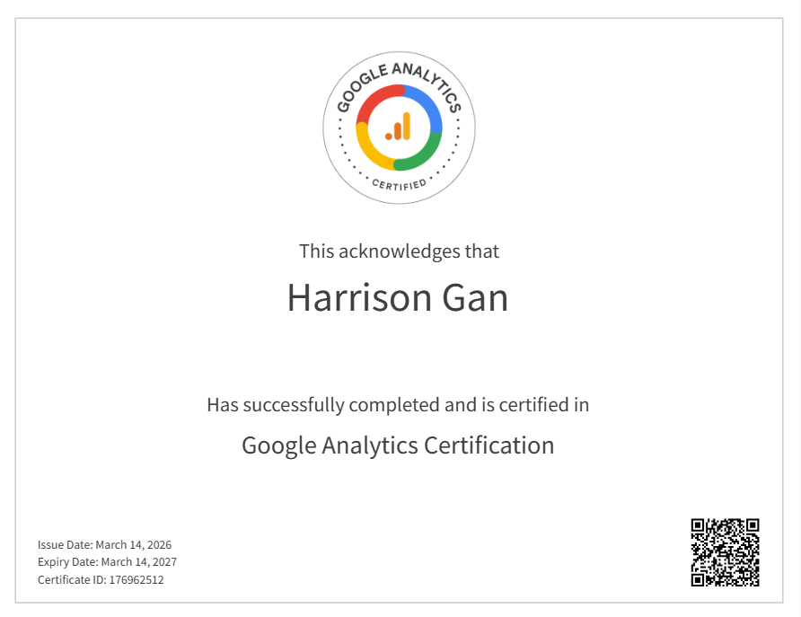

This page highlights what I learned and accomplished in IBM 3202 through Google Analytics, Quarto, dashboards, and marketing performance analysis. This section connects my technical coursework to my career interest in marketing.

## Google Analytics Certification

As part of this course, I completed Google Analytics-related training and practiced using analytics concepts to understand digital performance.

{.cert-image}

[Google Analytics Individual Qualification](PASTE-YOUR-CERTIFICATION-LINK-HERE)

## What I Learned in IBM 3202

IBM 3202 helped me understand how data, websites, dashboards, and analytics tools can support business and marketing decisions. Instead of only thinking about marketing creatively, I learned how to measure performance using data.

Some of the most important topics I learned include:

- Google Analytics 4
- Website traffic analysis
- User acquisition
- Engagement metrics
- Conversion events
- KPI tracking
- Marketing dashboards
- Quarto website development
- R-based data visualization
- GitHub publishing

## Key Google Analytics Concepts

### Engagement

Engagement shows how users interact with a website after they arrive. Important engagement metrics can include page views, average engagement time, clicks, and returning users.

This connects to marketing because strong content should keep people interested. For example, if customers spend more time viewing furniture product pages, that may suggest the products, images, or descriptions are attracting attention.

### Audience Insights

Audience insights help marketers understand who is interacting with their content. This can include user behavior, interests, location, device type, and returning visitor patterns.

For my marketing career, audience insights are valuable because strong marketing should be designed for a specific target audience. With Homey Design, audience insights could help identify what types of furniture customers are most interested in. For CEO Club, they could help show what types of students are most engaged with entrepreneurship events, newsletters, and social media content.

### Acquisition

Acquisition focuses on where users come from. This can include organic search, direct traffic, paid search, referrals, email, or social media.

In marketing, acquisition matters because it helps identify which channels are bringing people to a website. For a business like Homey Design, this could help show whether customers are finding the company through Google Search, social media, online ads, or direct website visits.

## Google Analytics Achievements

Through my Google Analytics certification and coursework, I developed skills in measuring digital performance, understanding user behavior, and connecting analytics data to marketing decisions.

::: {.achievement-grid}

::: {.achievement-card}
### Earned Google Analytics Certification

Completed Google Analytics certification training and demonstrated knowledge of important analytics concepts, including reports, events, engagement, and digital performance measurement.
:::

::: {.achievement-card}
### Learned Website Traffic Analysis

Developed an understanding of how to evaluate where users come from, including organic search, direct traffic, referrals, social media, and paid marketing channels.
:::

::: {.achievement-card}
### Practiced Engagement Analysis

Learned how to review user engagement metrics such as page views, clicks, average engagement time, and returning visitors to better understand how people interact with digital content.
:::

::: {.achievement-card}
### Connected Analytics to Marketing Decisions

Practiced using Google Analytics insights to support marketing decisions, such as identifying strong traffic sources, improving content strategy, and measuring audience interest.
:::

:::

## Reflection

IBM 3202 helped me build a stronger understanding of how marketing data can be used to make better business decisions. I learned that successful marketing is not only about creating content, but also about measuring performance, understanding customer behavior, and using evidence to improve future strategy.

This class gave me practical experience with tools like Google Analytics. These skills support my career goal of becoming a marketing professional who can combine creativity, business strategy, and data-driven decision-making.